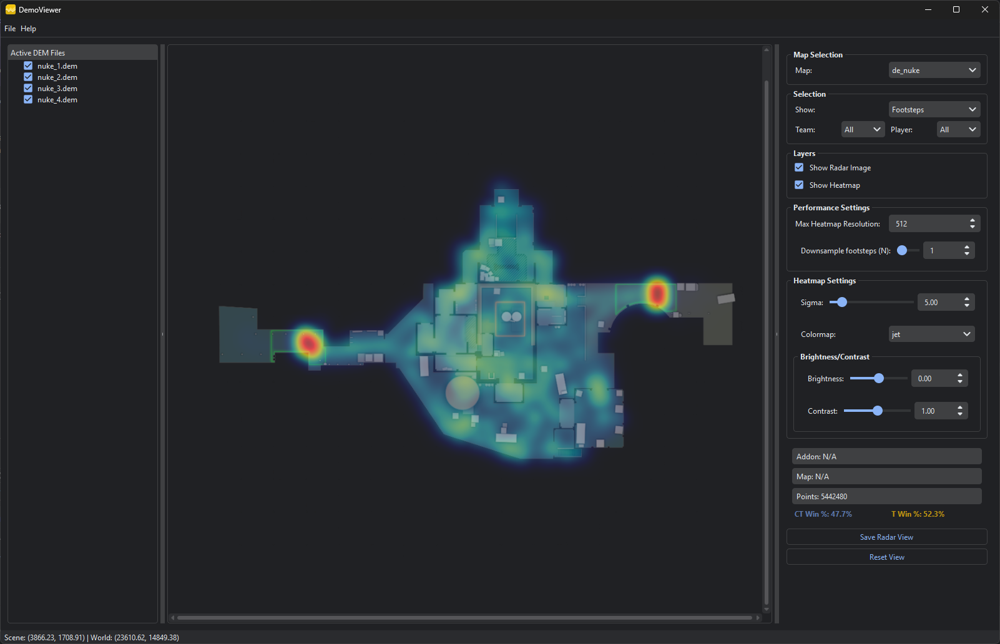

# DemoViewer

DemoViewer is an easy-to-use tool for analyzing multiple Counter-Strike 2 (CS2) demo files at the same time. It helps you visualize and understand gameplay by showing heatmaps, tracking player movements, and overlaying important events. With DemoViewer, you can quickly gain insights into strategies and player behavior across different matches.

## Features

- Open and analyze several CS2 demo files together
- View interactive heatmaps for footsteps, deaths, and other in-game events
- Adjust heatmap brightness, contrast, and gamma for better visibility
- Efficiently handles large demo files with advanced downsampling and caching
- Easily switch maps and use session-based radar image caching
- Simple, user-friendly interface with zoom and pan support for map views

## Screenshot

## License

This project is for educational and analytical use. See [LICENSE](LICENSE) for more information.
